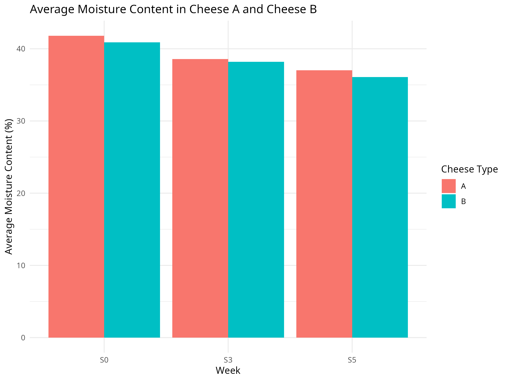
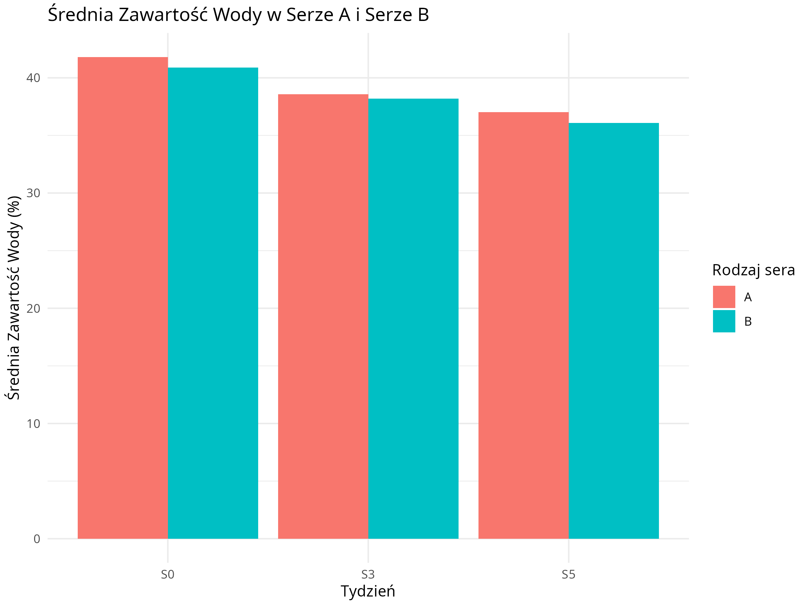

# Statistical Analysis of Moisture Content in Processed Cheeses

### Analiza statystyczna zawartości wilgoci w serach topionych

---

Choose language / Wybierz język:

* [🇬🇧 English Version](#english-version)
* [🇵🇱 Wersja Polska](#wersja-polska)

---

## 🇬🇧 English Version

This project focuses on analyzing the impact of storage time on the moisture content of two types of processed cheeses (Cheese A and Cheese B). The study monitors changes across three stages: **S0** (fresh product), **S3** (week 3), and **S5** (week 5).

Due to a **small sample size ($n=5$)** and the absence of a normal distribution, **non-parametric statistical methods** were applied. This approach ensures robust hypothesis testing despite the limited amount of data.

## Analysis Objectives

1. **Time Impact:** To determine if storage time significantly affects moisture reduction (S0 vs S3 vs S5).
2. **Dynamics of Change:** To compare the drying rate across different stages (S0 $\rightarrow$ S3 and S3 $\rightarrow$ S5).
3. **Product Comparison:** To verify if the moisture loss process differs between Cheese A and Cheese B.
4. **Loss Estimation:** To calculate the average percentage decrease in moisture content.

## Data Visualization

  

## Key Findings

* **Significant Initial Decline:** A highly statistically significant decrease in moisture content was observed during the first stage (S0 $\rightarrow$ S3) for both products ($p < 0.05$).
* **Process Stabilization:** After week 3, the drying process significantly slows down; the differences between S3 and S5 are not statistically significant ($p > 0.05$).
* **No Significant Product Difference:** The analysis revealed that both types of cheese lose moisture in an almost identical manner ($p > 0.05$ for all compared intervals).
* **Scale of Phenomenon:** The average relative decrease in moisture content over the entire period (S0-S5) was approximately **11.61%**.

## Tech Stack

* **Language:** [R](https://www.r-project.org/) (R Markdown $\rightarrow$ PDF)
* **Libraries:** `ggplot2` (visualization), `reshape2` (data wrangling), `stats` (non-parametric testing).
* **Statistical Methods:** Mann-Whitney U test, Kruskal-Wallis test.

## Documentation

* [Full Report (PDF) - Polish version only](analiza_serow.pdf)
* [Source Code (Rmd) - Polish version only](analiza_serow.Rmd)

## Author

**Wilchelm**

*Project completed as part of the "Non-parametric Statistics" course.*

# 🇵🇱 Wersja Polska

## Opis Projektu

Projekt dotyczy analizy wpływu czasu przechowywania na zawartość wody w dwóch rodzajach serów (Ser A oraz Ser B). Badanie monitoruje zmiany w trzech etapach: **S0** (produkt świeży), **S3** (3. tydzień) oraz **S5** (5. tydzień).

Ze względu na **małą liczebność próby ($n=5$)** i brak rozkładu normalnego, w analizie zastosowano **metody statystyki nieparametrycznej**, co pozwoliło na rzetelną weryfikację hipotez przy ograniczonej ilości danych.

## Cele Analizy

1. **Wpływ czasu:** Określenie, czy czas przechowywania istotnie wpływa na spadek wilgotności (S0 vs S3 vs S5).
2. **Dynamika zmian:** Porównanie tempa wysychania w różnych etapach (S0 $\rightarrow$ S3 oraz S3 $\rightarrow$ S5).
3. **Porównanie produktów:** Weryfikacja, czy proces utraty wody różni się między Serem A a Serem B.
4. **Szacowanie utraty:** Obliczenie średniego procentowego spadku zawartości wody.

## Prezentacja Danych

  

## Kluczowe Wnioski

* **Istotny spadek początkowy:** W pierwszym etapie (S0 $\rightarrow$ S3) oba produkty wykazują bardzo istotny statystycznie spadek zawartości wody ($p < 0,05$).
* **Stabilizacja procesu:** Po 3. tygodniu proces wysychania wyraźnie zwalnia – różnice między S3 a S5 nie są istotne statystycznie ($p > 0,05$).
* **Brak różnic między produktami:** Analiza wykazała, że oba rodzaje sera tracą wodę w niemal identyczny sposób ($p > 0,05$ dla wszystkich porównywanych interwałów).
* **Skala zjawiska:** Średni względny spadek zawartości wody w całym okresie (S0-S5) wyniósł ok. **11,61%**.

## Technologie

* **Język:** [R](https://www.r-project.org/) (R Markdown $\rightarrow$ PDF)
* **Biblioteki:** `ggplot2` (wizualizacja), `reshape2` (data wrangling), `stats` (testy nieparametryczne).
* **Metody:** Test U Manna-Whitneya, Test Kruskala-Wallisa.

## Dokumentacja

* [Pełny raport (PDF)](analiza_serow.pdf)
* [Kod źródłowy (Rmd)](analiza_serow.Rmd)

## Autor

**Wilchelm**

*Projekt zrealizowany w ramach kursu: Statystyka Nieparametryczna.*